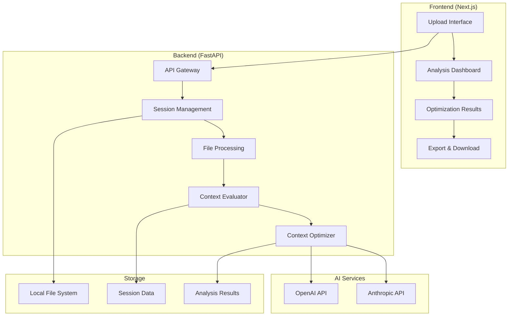

# ContextOptimizer

<div align="center">
  
  
  
  
  
  
</div>

<div align="center">
  <h3>🚀 Intelligent Context Engineering Assistant for Multi-Agent Systems</h3>
  <p>Analyze, optimize, and enhance your AI agent configurations with AI-powered insights</p>
</div>

---

## 📋 Table of Contents

- [🎯 Overview](#-overview)
- [✨ Key Features](#-key-features)
- [🏗️ Architecture](#-architecture)
- [🛠️ Technology Stack](#-technology-stack)
- [🚀 Quick Start](#-quick-start)
- [📊 Usage Guide](#-usage-guide)
- [🔧 Development](#-development)
- [📚 API Documentation](#-api-documentation)
- [🤝 Contributing](#-contributing)
- [📄 License](#-license)

## 🎯 Overview

ContextOptimizer is an intelligent context engineering assistant designed specifically for Multi-Agent Systems (MAS). It addresses the critical challenge of optimizing **System Prompts** and **tool return information** to ensure clear, coherent, and efficient context flow between agents.

### 🎯 Problem Statement

Multi-Agent Systems often suffer from:
- **Context Logic Breakdown**: Unclear communication between agents
- **Suboptimal System Prompts**: Vague instructions leading to poor performance
- **Inconsistent Tool Information**: Unstructured data causing confusion
- **Manual Optimization**: Time-consuming trial-and-error approach

### 💡 Solution

ContextOptimizer provides:
- **Automated Analysis**: AI-powered evaluation of agent configurations
- **Intelligent Optimization**: Data-driven recommendations for improvement
- **Coordinated Enhancement**: Simultaneous optimization of prompts and tools
- **Actionable Insights**: Ready-to-implement solutions

## ✨ Key Features

### 🔍 **Context Logic Diagnosis**
- Automatically identify context breakage issues in multi-agent conversations
- 5-dimensional evaluation system (Prompt Clarity, Context Flow, Tool Integration, Error Handling, Performance)
- Priority-based issue classification with detailed impact analysis

### 🎯 **Coordinated Optimization**
- Simultaneous optimization of system prompts and tool return formats
- Three optimization levels: Conservative, Balanced, Aggressive
- Focus area customization for targeted improvements

### 📊 **Actionable Solutions**
- Ready-to-use optimized agent configurations
- Detailed implementation guides with expected improvements
- Export functionality for seamless integration

### 🧠 **Best Practices Accumulation**
- Learn from successful optimization patterns
- Apply proven strategies to new configurations
- Continuous improvement through AI feedback

## 🏗️ Architecture



## 🛠️ Technology Stack

### Backend
- **Framework**: FastAPI 0.110+ (Python 3.12+)
- **AI Integration**: OpenAI API, Anthropic API
- **Data Processing**: Pydantic for validation, JSON for storage
- **Session Management**: File-based with UUID tracking
- **Testing**: Pytest with async support

### Frontend
- **Framework**: Next.js 15.3+ with React 19
- **UI Components**: Tailwind CSS + Headless UI
- **Type Safety**: TypeScript 5.7+
- **State Management**: React hooks with local state
- **Build Tools**: Turbopack for fast development

### Infrastructure
- **Deployment**: Docker containerization
- **Development**: Hot reload for both frontend and backend
- **Storage**: Local file system with structured directories
- **Logging**: Structured logging with configurable levels

## 🚀 Quick Start

### Prerequisites

- **Python 3.12+** with pip or uv
- **Node.js 18+** with npm
- **OpenAI API Key** (required for AI analysis)
- **Docker** (optional, for containerized deployment)

### Option 1: Docker Deployment (Recommended)

```bash
# 1. Clone the repository
git clone https://github.com/lml2468/ContextOptimizer.git
cd ContextOptimizer

# 2. Set up environment variables
cp .env.example .env
# Edit .env with your OpenAI API key

# 3. Build and run with Docker Compose
docker-compose up -d

# 4. Access the application
# Frontend: http://localhost:3000
# Backend API: http://localhost:8000
```

### Option 2: Development Setup

```bash
# 1. Clone the repository
git clone https://github.com/lml2468/ContextOptimizer.git
cd ContextOptimizer

# 2. Set up backend
cd backend
python -m venv venv
source venv/bin/activate  # On Windows: venv\Scripts\activate
pip install uv
uv pip install -e .

# 3. Set up frontend
cd ../frontend
npm install

# 4. Set up environment variables
cp .env.example .env
# Edit .env with your OpenAI API key

# 5. Start development servers
# Terminal 1 (Backend)
cd backend
python start_backend.py

# Terminal 2 (Frontend)
cd frontend
npm run dev

# 6. Access the application
# Frontend: http://localhost:3000
# Backend API: http://localhost:8000
```

### Option 3: Quick Development Script

```bash
# Use the provided development script
chmod +x scripts/dev.sh
./scripts/dev.sh setup    # Setup both environments
./scripts/dev.sh dev      # Start both servers
```

## 📊 Usage Guide

### 1. **Data Preparation**

Prepare two JSON files:

**agents_config.json** - Agent configurations:
```json
[
  {
    "agent_id": "supervisor",
    "agent_name": "Supervisor Agent",
    "version": "1.0",
    "system_prompt": "You are a supervisor agent...",
    "tools": [
      {
        "name": "planning",
        "description": "Create and manage execution plans"
      }
    ]
  }
]
```

**messages_dataset.json** - Conversation history:
```json
{
  "messages": [
    {
      "content": "Hello, I need help with...",
      "type": "human",
      "name": "user"
    },
    {
      "content": "I'll help you with that...",
      "type": "ai",
      "name": "supervisor"
    }
  ]
}
```

### 2. **Upload and Analysis**

1. **Upload Files**: Navigate to the sessions page and upload your JSON files
2. **Start Analysis**: Click "Start Analysis" to begin the AI-powered evaluation
3. **Review Results**: Examine the 5-dimensional analysis report with priority issues

### 3. **Optimization**

1. **Generate Optimization**: Click "Generate Optimization" from the analysis page
2. **Review Recommendations**: Examine optimized system prompts and tool formats
3. **Apply Changes**: Copy optimized configurations to your system
4. **Download Reports**: Export complete analysis and optimization reports

### 4. **Implementation**

1. **Update Agent Configs**: Replace system prompts with optimized versions
2. **Standardize Tool Formats**: Implement recommended tool return structures
3. **Monitor Performance**: Track improvements in agent coordination
4. **Iterate**: Re-analyze and optimize as your system evolves

## 🔧 Development

### Project Structure

```
ContextOptimizer/
├── backend/                    # FastAPI backend
│   ├── app/
│   │   ├── api/               # API routes
│   │   ├── core/              # Business logic
│   │   ├── models/            # Data models
│   │   ├── services/          # Service layer
│   │   └── utils/             # Utilities
│   ├── tests/                 # Test files
│   └── test_data/             # Sample data
├── frontend/                   # Next.js frontend
│   ├── src/
│   │   ├── app/               # App router pages
│   │   ├── components/        # React components
│   │   ├── types/             # TypeScript types
│   │   └── utils/             # Utility functions
│   └── public/                # Static assets
├── scripts/                    # Development scripts
├── docker-compose.yml          # Docker configuration
└── Dockerfile                 # Container definition
```

### Running Tests

```bash
# Backend tests
cd backend
source venv/bin/activate
python -m pytest tests/ -v

# Frontend type checking
cd frontend
npm run type-check

# Frontend linting
npm run lint
```

### Development Scripts

```bash
# Setup development environment
./scripts/dev.sh setup

# Start both servers
./scripts/dev.sh dev

# Run tests
./scripts/dev.sh test

# Build for production
./scripts/dev.sh build

# Clean development files
./scripts/dev.sh clean
```

## 📚 API Documentation

Once the backend is running, access the interactive API documentation:

- **Swagger UI**: http://localhost:8000/docs
- **ReDoc**: http://localhost:8000/redoc

### Key Endpoints

- `POST /api/v1/upload` - Upload agent configuration and message files
- `POST /api/v1/analyze` - Start context analysis
- `GET /api/v1/session/{session_id}/evaluation` - Get analysis results
- `POST /api/v1/optimize/{session_id}` - Generate optimization recommendations
- `GET /api/v1/sessions` - List all analysis sessions

## 🤝 Contributing

We welcome contributions from the community! Here's how you can help:

### 🐛 Bug Reports

1. Check existing issues to avoid duplicates
2. Use the bug report template
3. Include detailed reproduction steps
4. Provide system information and logs

### 💡 Feature Requests

1. Search existing feature requests
2. Use the feature request template
3. Explain the use case and benefits
4. Provide mockups or examples if applicable

### 🔧 Code Contributions

1. **Fork the repository**
2. **Create a feature branch**: `git checkout -b feature/amazing-feature`
3. **Follow coding standards**: Use Black for Python, ESLint for TypeScript
4. **Write tests**: Ensure good test coverage
5. **Update documentation**: Include relevant documentation updates
6. **Commit with conventional commits**: `feat: add amazing feature`
7. **Push to your fork**: `git push origin feature/amazing-feature`
8. **Open a Pull Request**: Use the PR template

### 📝 Development Guidelines

- **Code Style**: Follow PEP 8 for Python, ESLint/Prettier for TypeScript
- **Testing**: Write unit tests for new features
- **Documentation**: Update README and API docs as needed
- **Performance**: Consider performance implications of changes
- **Security**: Follow security best practices

## 📄 License

This project is licensed under the MIT License - see the [LICENSE](LICENSE) file for details.

## 🙏 Acknowledgments

- **OpenAI** for providing powerful language models
- **FastAPI** for the excellent Python web framework
- **Next.js** for the robust React framework
- **Tailwind CSS** for beautiful, responsive design
- **The open-source community** for inspiration and tools

## 📞 Support

- **GitHub Issues**: For bug reports and feature requests
- **Discussions**: For questions and community support
- **Documentation**: Check the docs for detailed guides

---

<div align="center">
  <p>Made with ❤️ by the ContextOptimizer Team</p>
  <p>⭐ Star us on GitHub if this project helped you!</p>
</div>
